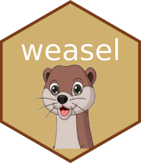

<!-- README.md is generated from README.Rmd. Please edit that file -->

```{r, include = FALSE}
knitr::opts_chunk$set(
  collapse = TRUE,
  comment = "#>",
  fig.path = "man/figures/README-",
  out.width = "100%"
)
library(weasel)
```

# weasel 

<!-- badges: start -->
<!-- badges: end -->

> *'Round and 'round the R workspace, code-monkey chased the {weasel}*
>
> *Code-monkey stopped to pop the first val...*
>
> *`pop()` goes the {weasel}*

## Installation

You can install the development version of weasel like so:

``` r
# install.packages("remotes")
remotes::install_github("jonocarroll/weasel")
```

## Motivation

Inspired by other (less functional/immutable) languages where one might be 
familiar with being able to `pop()` a value from the top of the stack, this 
package provides similar functionality.

If we define a vector `a` containing some values

```{r}
a <- c(3, 1, 4, 1, 5, 9)
```

and we wish to extract the first value, we can certainly do so with 

```{r}
a[1]
```

but, due to the nature of R, the vector `a` is unchanged

```{r}
a
```

Instead, we could remove the first value of `a` with

```{r}
a[-1]
```

but again, `a` remains unchanged - in order to modify `a` we must redefine it as e.g.

```{r}
a <- a[-1]
a
```

This differs from other languages were we might want to _extract_ that first value for use, 
and leave the rest of the vector in place.

## Usage

{weasel} offers that functionality

```{r}
a <- c(3, 1, 4, 1, 5, 9)
a
first_val <- pop(a)
a
first_val
```

Note that this did not require explicitly^[It certainly is redefined internally, but 
the use of `defmacro()` means it does not need to be explicit] redefining `a`; 
the return value of `pop()` is the popped value.

This is also a Generic, so it is defined for some classes (`vector`, `list`, `data.frame`) 
and can be extended.

With a `list`:

```{r}
a <- list(x = c(2, 3), y = c("foo", "bar"), z = c(3.1, 4.2, 6.9))
a
x <- pop(a)
a
x
```

With a `data.frame`:

```{r}
a <- data.frame(x = c(2, 3, 4), y = c("foo", "bar", "baz"), z = c(3.1, 4.2, 6.9))
a
x <- pop(a)
a
x
```

{weasel} also offers `push()` functionality

```{r}
a <- c(1, 4, 1, 5, 9)
a
push(a, 3)
a
```

which is also Generic

```{r}
a <- list(y = c("foo", "bar"), z = c(3.1, 4.2, 6.9))
a
push(a, list(new_vals = c(99, 77)))
a

a <- data.frame(y = c("foo", "bar", "baz"), z = c(3.1, 4.2, 6.9))
a
push(a, data.frame(y = 99, z = 77))
a
```

## Warnings

Please note that this is intended only for informal use and education. This 
functionality is **not** idiomatic R and is more of a footgun than should be 
tolerated.

## Explanation

Internally, the evaluation of each 'method' is a macro defined using `gtools::defmacro()` 
which enables substitution of input arguments and redefinition in the parent namespace.

[This blogpost](https://jcarroll.com.au/TODO) covers the full details. [This article](https://www.r-project.org/doc/Rnews/Rnews_2001-3.pdf) in the R News Newsletter 
covers the construction and motivation of `defmacro()`.

